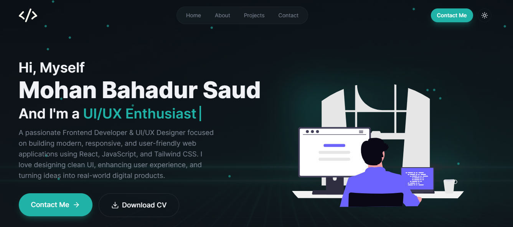
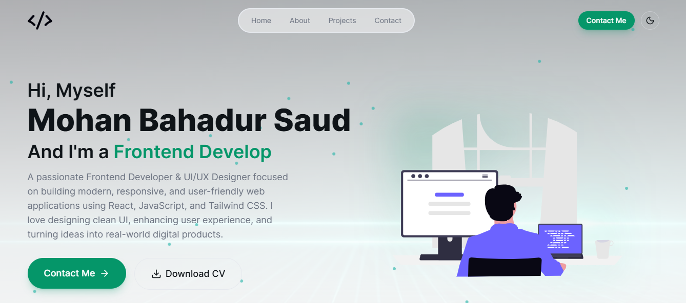
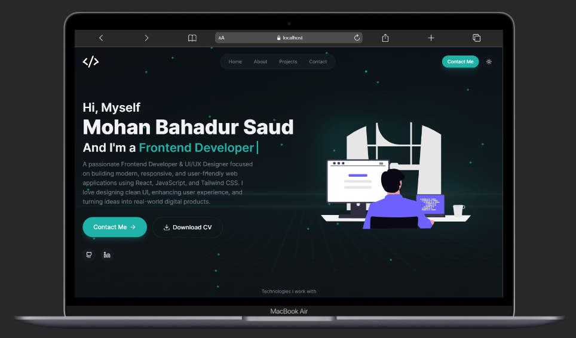
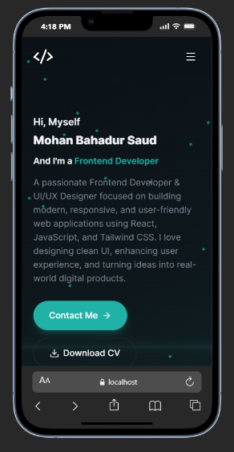

# Portfolio Website

A concise, responsive personal portfolio showcasing projects, skills, and a downloadable CV. Built with React, Vite, and Tailwind CSS, it includes a contact form (EmailJS) and deploys to GitHub Pages.

## Screenshots

Preview of the portfolio across different devices and themes.






🔹 Report Bug     🔹 Request Feature

**Built With**
My personal portfolio which features some GitHub projects as well as a resume and technical skills.

This project was built using these technologies:

- React.js
- Vite
- Tailwind CSS
- JavaScript (ESModules)
- EmailJS (contact form)
- Lucide icons

**Features**

- 📖 Multi-Page / Section Layout
- 🎨 Styled with Tailwind CSS for easy customization
- 📱 Fully Responsive (desktop, tablet, mobile)
- ✉️ Contact form powered by EmailJS

**Getting Started**
Clone down this repository. You will need `node` and `git` installed globally on your machine.

🛠 Installation and Setup Instructions

Installation:

```bash
npm install
```

In the project directory, you can run the development server:

```bash
npm run dev
```

Runs the app in development mode. Open http://localhost:5173 to view it in the browser. The page will reload if you make edits.

If you need a production build:

```bash
npm run build
npm run preview
```

**Notes**
- The `dev` script uses Vite. Default dev server port is `5173`.
- Update `public/outputs/largeScreen.png` with your preferred screenshot if you want the README to show a different image.

---

**Demo**

Live demo: [https://mohanbahadursaud.github.io/Portfolio/](https://portfolio-ld09c19iv-mohan-sauds-projects.vercel.app/)

Enjoy! 👋
